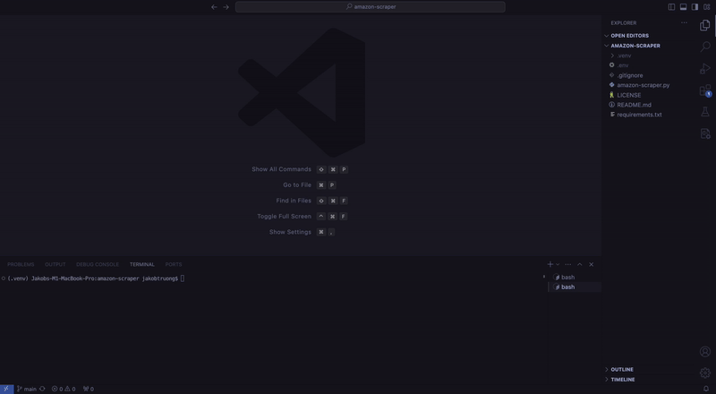

# Amazon Product Web Scraper
This web scraper utilizes Playwright, BeautifulSoup4, and pandas to scrape and crawl through Amazon product search pages given a valid url as an input to extract relevant purchase information such as product name, product rating, image url, product url, and if the product is currently on sale.

## Installation
Navigate to the desired file directory location and clone the repository.
```bash
git clone https://github.com/jakobtruong/amazon-scraper.git
```

---
### Setting Up Virtual Environment (Optional)
In case any readers of this are unfamiliar with virtual environments, it is generally recommended to set up virtual environments for each project to create an isolated python environment. Virtual environments are stable, reproducable, and portable while leaving just the necessary dependencies for the project to execute successfully.

To create the virtual environment, use the following command. The last argument (ex: '.venv') can be freely renamed to anything the user decides to name the virtual environment folder.

```bash
python3 -m venv .venv
```

To activate the virtual environment, use the following command.
```bash
source .venv/bin/activate
```

To deactivate the virtual environment, use `deactivate` in the terminal.

Using `which python3` can be useful for identifying and confirming where your current Python3 path is pointing to.

---
Finally, install necessary dependencies using the following command.
```bash
pip install -r requirements.txt
```

## Usage
1. In a terminal, execute the amazon-scraper.py by using the folowing `python3 amazon-scraper.py`.
2. The program will prompt the user to enter a url. An example url can be found [here](https://www.amazon.com/s?k=technology&crid=25DJB16HLDJQB&sprefix=technology%2Caps%2C136&ref=nb_sb_noss_1).
3. The program will then prompt the user to enter a integer represening how many pages starting from the url given in the previous step as a starting point to web crawl and scrape.
4. The program will then output a .csv named amazon_products_listings.csv in the project's root directory.

## License
This project is licensed under the MIT License - see the [LICENSE](./LICENSE) file for details.
